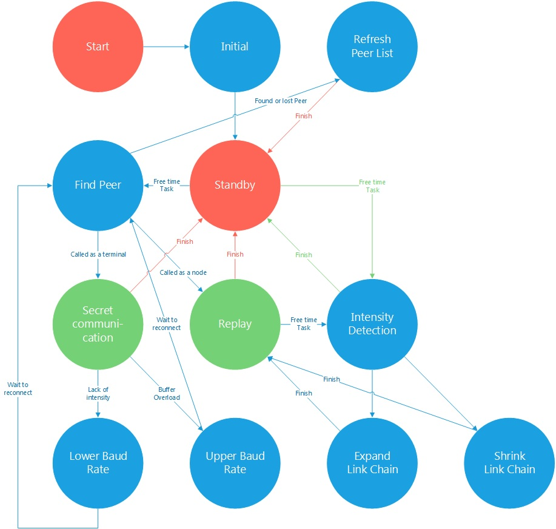
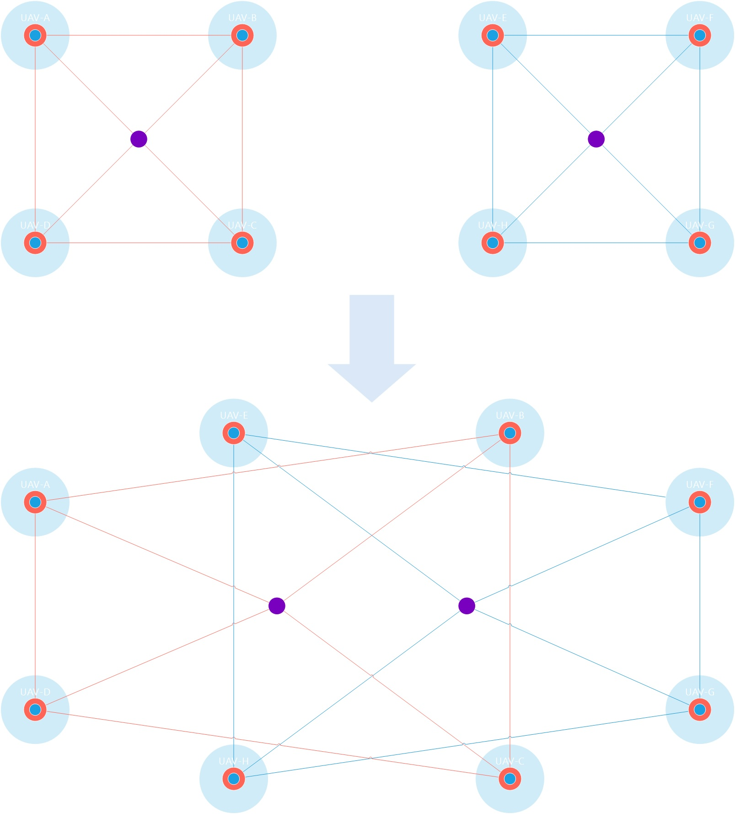

#Abstract

Forest Operating System (FOS) is a concurrently, distributed, 
cuttable, real-time operating system framework.

It is contructed form hardware level, to application level.

#Contents

- [Over view](#user-cotent-0)

- [Computing Node](#user-content-1)

- [UAV Control Model](#user-content-2) 

- [Group Control Model](#user-content-3) 

- [Radio communication](#user-content-4)

- [Communication Protocol Stack](#user-content-5)

- [topological](#user-content-6)

- [Muliti Group](#user-content-7)

#Over view

#Computing Node

##Brief
##Model
###Firmware model

###Data stream model

###Network model

 

##Memory Management Unit (MMU)

###Brief
In FOS, every computing Node is contructed by a core unit whitch is a MMU.
FOS's MMU can be a soft implementation, 
a hard implementation or a mixed implementation.

In order to actrualize this unit easily, 

MMU's I/O is mulitable,

###Model

###Actrualize

###I/O

##Linker
###Brief
Linker is a specific data stack, which is used to share data between two different computing node.
###Model

##Data stacks
###Brief
###Model

#UAV Control Model
###Brief
###Model

As a black box, this Control model seems like:

Or in real world it seems like:

#Group Control Model

##Problem Model

##Basic Model
##Promotion

#Radio communication

As a radio data transport device, there're 4 things needs to consider:
frequency, channel, power and stack.

In this case, we provide a full functional stack, including features below:

- Secret communication
- Automatic frequency hopping
- Global broadcast
- Auto topology construction
- Signal intensity detection
- Flexible baud rate

State machine

#Communication Protocol Stack

#Topological

#Muliti Group

##Problem Model
