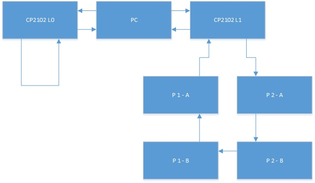
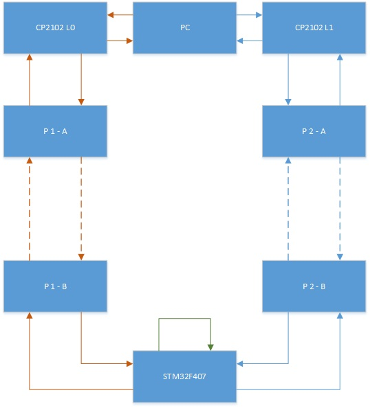
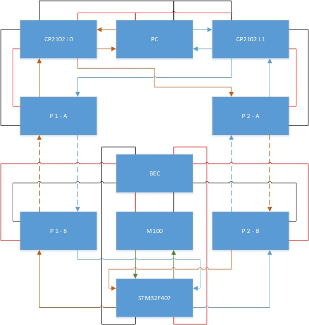
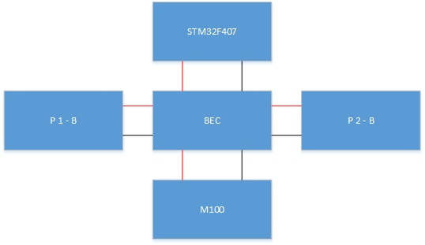
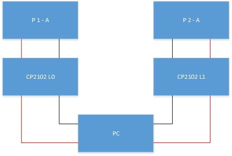
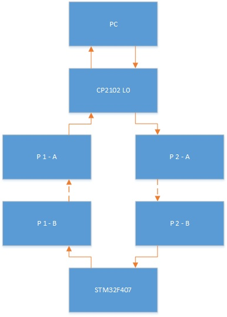
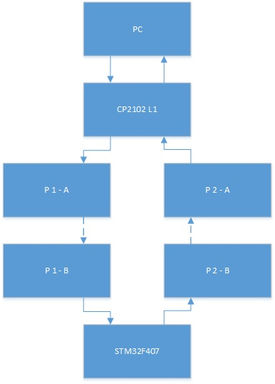
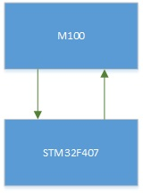

[EN](#user-content-E0)|[中文](#user-content-C0)

#MOC-DJISDK

MOC-DJISDK，is a DJI-onboardSDK for ARM 32-bit Cortex-M4（STM32F4）or higher preformance embessed system.

#Contents

- [Quick Start](#user-content-E1)

- [Overview](#user-content-E2) 

- [API](#user-content-E3) 

- [FAQ](#user-content-E4)

- [Do & Don't](#user-content-E5)

#Quick Start

We strongly suggest you to read this part, no matter it is your first time or not.

##Hardware Checklist 

-M100

-STM32F407 Miniun system.

-STLink 1 pics.

-BEC 5V3A or higher.

-CP2102 module 2 pics.

-UART RF module 4 pics.

-Appropriate amount of DoPont wire， 3M foamed double-sided hesive tape.

##Software Enviroment

-MDK5(Keil uVision5)

If your PC is running in a Unix-like system or a Mac OS, you can install MDK5 with wine.

-QT5.5 or higher version

-STLink

or other programmer to programming the STM32 board.

##Tools

-Multimeter

-7.4V (2S) test battery for BEC with XT60 (optional)

##Build up steps

###Power Module

-Soldering XT60 （given by M100 fittings） to BEC's input. 

Pay attention to distinguish between positive and negative pole.

-Connect BEC to M100.

-Start M100, use multieter to test if BEC is working correctly or not.

-Shut down M100 disconnect M100 and BEC.

-(Plan A) Soldering BEC output to STM32 board.

Pay attention to distinguish between positive and negative pole.

-(Plan B) Soldering BEC output to a JST

-(Plan B step 2) Soldering JST to STM32 board.

Pay attention to distinguish between positive and negative pole.

###Peripheral system

-Link BEC and STM32 board (or it is already soldered).

-Link BEC to test battery or M100 and Start it.

-Check if STM32 board is running or not.

-Power off.

-Link STLink to STM32 board

	-at lesat 3 wires
	
	-GND

	-SCK

	-SDO

-Link STLink to PC

-Power on.

-Program the BuildUP.bin to STM32.

###Software Enviroment test

-

###Data Chain test

####PC-loop test

-Link CP2102 to PC, name it L0.

-Link an other CP2102 to PC name it L1.

-Configure RF module into 2 pairs, name them {P1-A,P1-B}, {P2-A,P2-B}.

-Link RX and TX in CP2102 L0. 

-Link P1-A TX to RX on CP2102 L1.

-Link P2-A RX to TX on CP2102 L1.

-Link P1-B RX to TX P2-B.

-Link P1-A, P1-B, P2-A, P2-B to Power source.

-Power on.

-**check RF module work correctly or not.**

-**Build and Run PCloop. **

####Data chain test

-Delink RX and TX in CP2102 L0.

-Link RX in CP2102 L0 to PA2 in STM32 board.

-Link TX in CP2102 L0 to PA3 in STM32 board.

-Link PA9 and PA10 in STM32 board.

-Delink P1-B RX to TX P2-B.

-Link PB10 in STM32 board to P1-B RX

-Link PB11 in STM32 board to P2-B TX.

-Program the BuildUP.bin to STM32.

-Build and Run DataChainTest.

-Power on STM32.

-if success DataChainTest will success.

-until now all hardware device is operating smoothly.

###Data Chain Build Up

This is a typical FOS Data Chain structure.

**To build up this, there are 5 steps.**

-**Build up onboard power system**

-**Build up upper machine power system**

-**Build up L0**

-**Build up L1**

-Build and run FOSDataChainTest

Now you build up a FOS minimum node and it's upper machine.

finaly connect this FOS Processing nod to M100.

-**Link M100 and STM32F407**

###Echo control

###Onboard control

#Overview

#API

#FAQ

#Do & Don't

#MOC-DJISDK

魔改版DJISDK，适用于ARM 32-bit Cortex-M4（STM32F4）及其性能以上的嵌入式系统或嵌入式PC。

#目录

- [快速启动](#user-content-C1)

- [概述](#user-content-C2) 

- [API接口说明](#user-content-C3) 

- [常见问题](#user-content-C4)

- [注意事项](#user-content-C5)

#快速启动

我们强烈建议您阅读此章节，无论是否是第一次使用。

##硬件设备清单

-M100飞行器套件；

-STM32F407最小系统；

-STLink；

-BEC稳压单元 5V3A 或更高功率；

-CP2102 USB-TTL 串口模块 2个；

-无线串口模块 4个；

-杜邦线、3M发泡贴纸适量；

##软件环境

-MDK5（Keil uVision5）；

如果您是Unix 或 Mac OS用户 可以使用wine来安装MDK5。

-QT5.5 或更高版本

-STLink 烧录器

或者其他STM32烧录器

##工具

-万用表

-7.4V (2S)测试用电池（可选）

##搭建步骤

###电源

-焊接XT60与BEC模块的输入端口;

注意区分正负极。

-连接BEC和M100

-启动M100，用万用表测量BEC输出是否正常。

-关闭M100，拆下BEC。

-（方法一） 将BEC输出焊接到STM32板上。

注意区分正负极。

-（方法二）将BEC输出焊接到JST插头上。

-（方法二之步骤2）将JST插头另一端子焊接到STM32板上。

注意区分正负极。

###外围系统

-连接BEC和STM32（或者他们已经焊接到一起）。

-连接BEC和测试电池（如果没有，则连接到M100上并启动）。

-检查STM32是否正常工作

-断电

-将STLink烧录器连接到STM32
	
	-至少需要连接三根线

	-GND
	
	-SCK

	-SDO

-连接STLink和电脑

-上电

-将 BuildUP.bin 烧录到 STM32中。

###软件环境测试

###数据链路

#概述

#API接口说明

#常见问题

#注意事项

