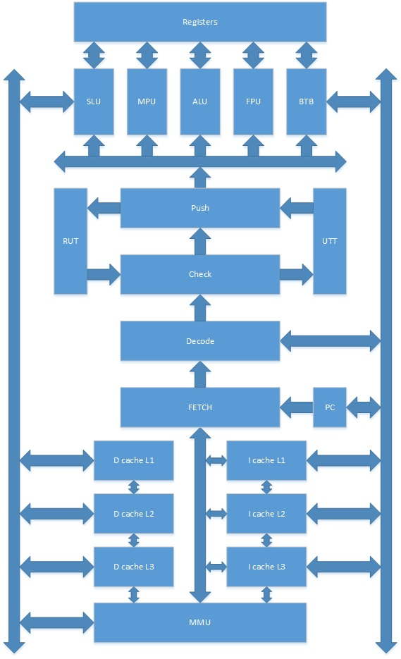

#BARN: RISC-V MCU CORE IN FOS
This Document introduced a RISC-V MCU family, whitch is used in FOS project.

#Contents

- [Overview](#user-content-0)
- [BEAN](#user-content-1)

#Overview

By using open-source CPU ISA, and consult UCB's project rocket, we build a CPU family.

| **Name** |	**Description**		 	| **Develop Status** |
|----------|----------------------------|--------------------|
| SPORE    | 8-Bit RISC-V processor  	|not started         |
| SEED     | 32-Bit RISC-V processor 	|not started         |
| BEAN     | 64-Bit RISC-V processor 	|prepareing          |
| NUT      |128-Bit RISC-V processor 	|not started         |
| GRANADA  |multi-Core RISC-V processor |not started         |

In RISC-V ISA 8-Bit ISA set is not decided(B Set), although it is effective for data package's encode and decode.
Core SPORE will still be the last core to actualize. 

#BEAN

##Framework
